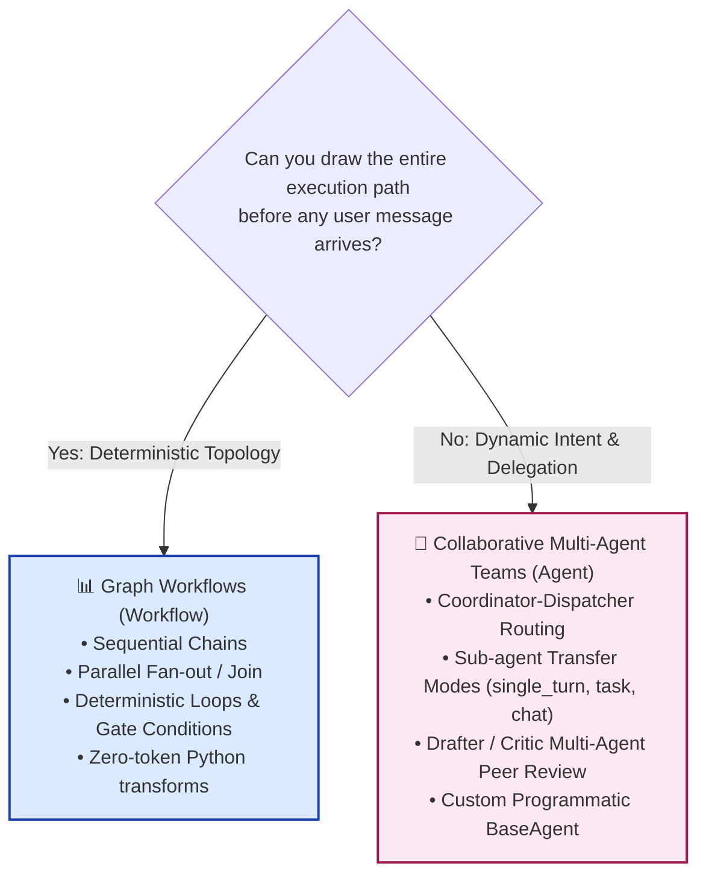
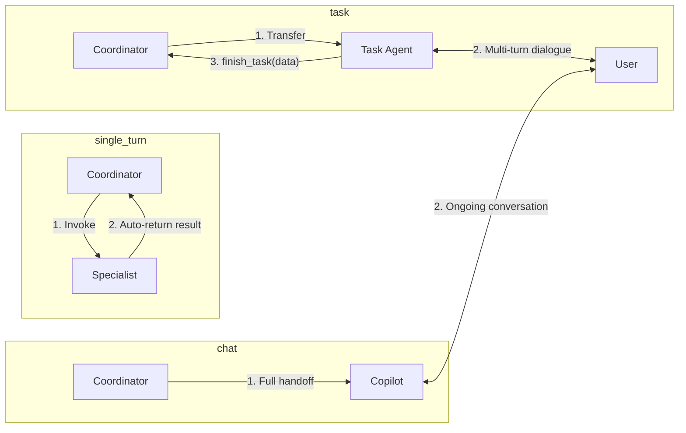

# Collaborative Workflows — ADK 2 by Example

> *"You define the specialist team. The LLM decides who to invoke and when."*

Collaborative workflows are designed for multi-agent architectures where the optimal execution path cannot be hardcoded upfront. Instead of drawing static graph edges, you define a team of specialist agents with clear semantic descriptions and transfer modes. The top-level coordinator evaluates the user's intent in real time and delegates tasks dynamically.

---

## 📌 Architectural Separation: Graphs vs. Collaborative Teams

In ADK 2.6+, workflow patterns are strictly separated into two paradigms:



> [!NOTE]
> **Deterministic Pipelines**: For fixed chains, parallel fan-out/join, and conditional graph routing, see the [Graph Workflows Guide](../graph-workflows/README.md).
>
> In ADK 2.6+, `SequentialAgent`, `ParallelAgent`, and `LoopAgent` are **deprecated** in favor of `Workflow`. This collaborative guide focuses exclusively on modern multi-agent coordination using `Agent` and `BaseAgent`.

---

## 🚀 Examples Overview

Each example is self-contained, tested against ADK 2.6+, and runnable against Vertex AI or Google AI Studio.

| # | File | Pattern | Core Concepts |
|---|---|---|---|
| 01 | [`01_coordinator_routing.py`](examples/01_coordinator_routing.py) | **Coordinator-Dispatcher** | `Agent(sub_agents=[...])` + semantic `description` routing |
| 02 | [`02_transfer_modes.py`](examples/02_transfer_modes.py) | **Sub-Agent Transfer Modes** | `single_turn`, `task` with `output_schema`, and `chat` copilot mode |
| 03 | [`03_supervisor_collaboration.py`](examples/03_supervisor_collaboration.py) | **Supervisor & Specialists** | Drafter + Critic multi-agent peer review without deprecated loops |
| 04 | [`04_custom_orchestrator.py`](examples/04_custom_orchestrator.py) | **Custom BaseAgent Orchestrator** | Programmatic control, `ctx.session.state`, and dynamic dispatch |
| 05 | [`05_complete_support_system.py`](examples/05_complete_support_system.py) | **Complete Support Concierge** | Full multi-agent customer support architecture |

---

## 🛠️ Setup & Running

```bash
# 1. Activate virtual environment
source .venv/bin/activate

# 2. Install dependencies
pip install google-adk pydantic

# 3. Configure credentials (Vertex AI or Gemini API key)
export GOOGLE_CLOUD_PROJECT="your-project-id"
export GOOGLE_CLOUD_LOCATION="us-central1"
export GOOGLE_GENAI_USE_VERTEXAI="True"
# Or: export GOOGLE_API_KEY="your-gemini-api-key"

# 4. Run any example
python collaborative-workflows/examples/01_coordinator_routing.py
```

---

## 🧩 Key Collaborative Patterns Explained

### 1. The Coordinator-Dispatcher (Supervisor Pattern)

The central coordinator uses the LLM to analyze the user's request and automatically hand off to the right specialist based on their `description`:

```python
from google.adk.agents import Agent

billing_specialist = Agent(
    name="billing_specialist",
    model=MODEL,
    description="Handles billing inquiries: refunds, incorrect charges, payment disputes, invoices, and pricing.",
    instruction="You are a billing specialist...",
)

coordinator = Agent(
    name="support_concierge",
    model=MODEL,
    instruction="Understand the user issue and transfer to the appropriate specialist. Do NOT answer directly.",
    sub_agents=[billing_specialist, tech_specialist, shipping_specialist],
)
```


---

### 2. Sub-Agent Transfer Modes & Lifecycles

ADK 2 introduces fine-grained lifecycle control for sub-agents via the `mode` parameter:



* **`mode="single_turn"`**: The sub-agent behaves like an intelligent tool. It executes once, returns its generated response to the coordinator without direct user interaction, and never strands the conversation.
* **`mode="task"`**: The sub-agent takes over to complete a specific structured objective. It can ask follow-up questions across multiple turns, validates its final data against a Pydantic `output_schema`, and automatically returns control to the coordinator when done.
* **`mode="chat"`** *(Default)*: Full conversational handoff where the sub-agent acts as an ongoing specialist copilot.

```python
# Single-turn: instant lookup
lookup_agent = Agent(
    name="account_lookup",
    instruction="Look up account tier and return summary.",
    mode="single_turn",
)

# Task mode: multi-turn structured goal
booking_agent = Agent(
    name="appointment_booker",
    instruction="Collect contact phone and preferred callback time, then finish_task.",
    mode="task",
    output_schema=BookingConfirmation,
)
```

---

### 3. Dynamic Multi-Agent Collaboration (Drafter + Critic)

Instead of using rigid loop constructs, a supervisor can orchestrate multi-agent peer review where specialized agents collaborate dynamically:

```python
# Drafter generates technical troubleshooting steps
tech_drafter = Agent(
    name="tech_drafter",
    description="Drafts initial technical troubleshooting steps for complex software issues.",
    mode="single_turn",
)

# Critic verifies clarity, customer empathy, and safety
quality_critic = Agent(
    name="quality_critic",
    description="Reviews technical drafts for safety, customer empathy, and clarity.",
    mode="single_turn",
)

# Supervisor coordinates the two specialists
supervisor = Agent(
    name="editorial_supervisor",
    instruction="""For technical issues:
    1. Delegate to tech_drafter to generate a technical plan.
    2. Delegate the draft to quality_critic to polish and verify.
    3. Return the approved response to the customer.""",
    sub_agents=[tech_drafter, quality_critic],
)
```

---

### 4. Custom Orchestration via `BaseAgent`

When you need programmatic decision logic, custom session state mutations, or circuit breaking, inherit from `BaseAgent` and implement `_run_async_impl`:

```python
from google.adk.agents import BaseAgent, Agent
from google.adk.agents.context import Context

class SmartCustomOrchestrator(BaseAgent):
    async def _run_async_impl(self, ctx: Context):
        # 1. Run triage
        async for event in triage_agent.run_async(ctx):
            yield event

        # 2. Inspect session state
        priority = ctx.session.state.get("triage_priority", "P3").upper()

        # 3. Dynamic dispatch based on state
        if priority in ("P1", "P2"):
            async for event in vip_enrichment.run_async(ctx):
                yield event
            async for event in urgent_responder.run_async(ctx):
                yield event
        else:
            async for event in standard_responder.run_async(ctx):
                yield event
```

---

## 🎯 Summary: When to Use What

| Requirement | Recommended Approach | ADK Primitive |
|---|---|---|
| Deterministic sequence or pipeline | Graph Workflow | `Workflow(edges=[(START, step1), (step1, step2)])` |
| Parallel fan-out & join | Graph Workflow | `Workflow` + `JoinNode` |
| Deterministic loop with quality gate | Graph Workflow | `Workflow` with conditional back-edge |
| Intent-based dynamic routing | Collaborative Team | `Agent(sub_agents=[...])` + semantic `description` |
| One-shot helper / intelligent tool | Collaborative Team | `Agent(mode="single_turn")` |
| Multi-turn data collection & form filling | Collaborative Team | `Agent(mode="task", output_schema=Model)` |
| Programmatic logic with session state | Custom Agent | Subclass `BaseAgent._run_async_impl` |

---

*Part of [ADK Workflow Patterns](../README.md)*
