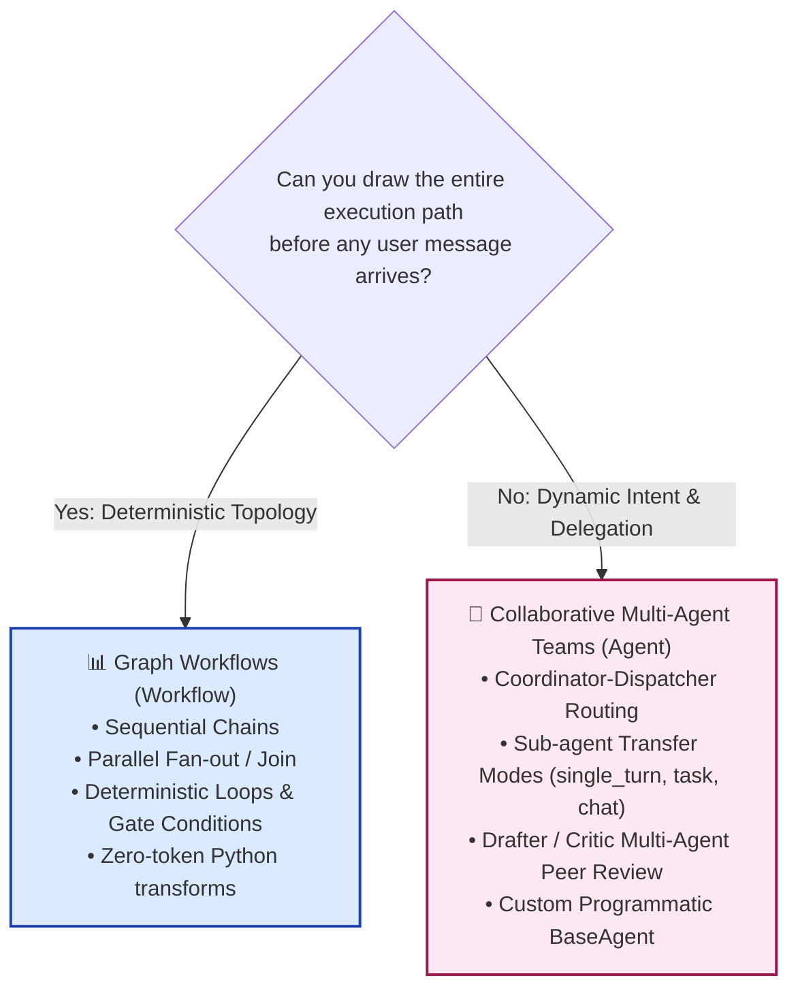
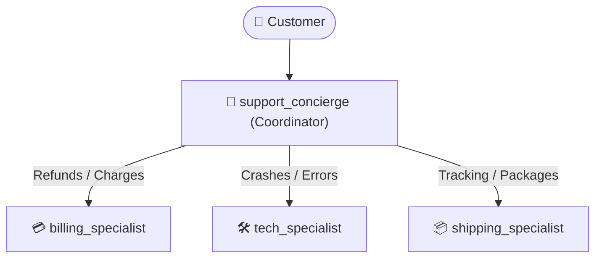
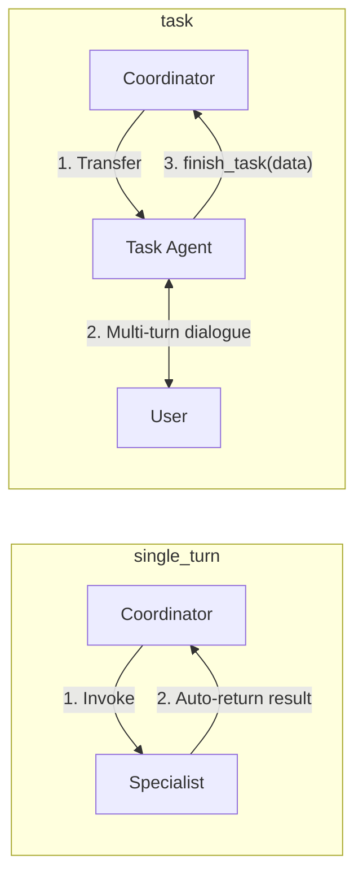
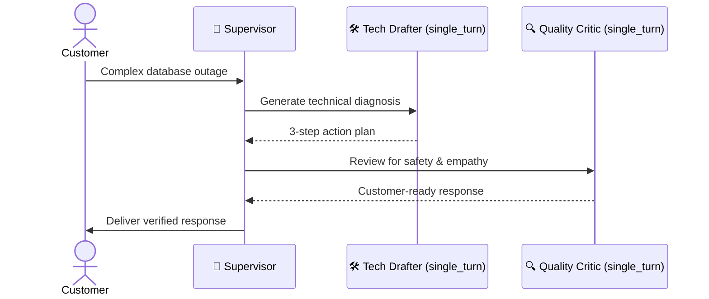

# Collaborative Workflows — ADK 2 by Example

> *"You define the specialist team. The LLM decides who to invoke and when."*

Collaborative workflows are designed for multi-agent architectures where the optimal execution path cannot be hardcoded upfront. Instead of drawing static graph edges, you define a team of specialist agents with clear semantic descriptions and transfer modes. The top-level coordinator evaluates the user's intent in real time and delegates tasks dynamically.

---

## 📌 Architectural Separation: Graphs vs. Collaborative Teams

In ADK 2.6+, workflow patterns are strictly separated into two paradigms:



> [!NOTE]
> **Deterministic Pipelines**: For fixed chains, parallel fan-out/join, and conditional graph routing, see the [Graph Workflows Guide](../graph-workflows/README.md).
>
> In ADK 2.6+, `SequentialAgent`, `ParallelAgent`, and `LoopAgent` are **deprecated** in favor of `Workflow`. This collaborative guide focuses exclusively on modern multi-agent coordination using `Agent` and `BaseAgent`.

---

## 🚀 Examples Overview

Each example is self-contained, tested against ADK 2.6+, and runnable against Vertex AI or Google AI Studio.

| # | File | Pattern | Core Concepts |
|---|---|---|---|
| 01 | [`01_coordinator_routing.py`](examples/01_coordinator_routing.py) | **Coordinator-Dispatcher** | `Agent(sub_agents=[...])` + semantic `description` routing |
| 02 | [`02_transfer_modes.py`](examples/02_transfer_modes.py) | **Sub-Agent Transfer Modes** | `single_turn`, `task` with `output_schema`, and `chat` copilot mode |
| 03 | [`03_supervisor_collaboration.py`](examples/03_supervisor_collaboration.py) | **Supervisor & Specialists** | Drafter + Critic multi-agent peer review without deprecated loops |
| 04 | [`04_custom_orchestrator.py`](examples/04_custom_orchestrator.py) | **Custom BaseAgent Orchestrator** | Programmatic control, `ctx.session.state`, and dynamic dispatch |
| 05 | [`05_complete_support_system.py`](examples/05_complete_support_system.py) | **Complete Support Concierge** | Full multi-agent customer support architecture |

---

## 🛠️ Setup & Running

```bash
# 1. Activate virtual environment
source .venv/bin/activate

# 2. Install dependencies
pip install google-adk pydantic

# 3. Configure credentials (Vertex AI or Gemini API key)
export GOOGLE_CLOUD_PROJECT="your-project-id"
export GOOGLE_CLOUD_LOCATION="us-central1"
export GOOGLE_GENAI_USE_VERTEXAI="True"
# Or: export GOOGLE_API_KEY="your-gemini-api-key"

# 4. Run any example
python collaborative-workflows/examples/01_coordinator_routing.py
```

---

## 🧩 Key Collaborative Patterns Explained

### 1. The Coordinator-Dispatcher (Supervisor Pattern)

#### Concept & Why to Use
When you have multiple specialized agents (billing, technical, shipping, general support), hardcoding routing conditions via keywords can become brittle. The Coordinator-Dispatcher pattern gives a central concierge agent a list of specialists. The coordinator inspects the user query, reads each sub-agent's `description`, and routes dynamically.



#### Code Implementation
```python
from google.adk.agents import Agent

billing_specialist = Agent(
    name="billing_specialist",
    model=MODEL,
    description="Handles billing inquiries: refunds, double charges, payment disputes, invoices, and pricing.",
    instruction="You are a billing specialist...",
)

coordinator = Agent(
    name="support_concierge",
    model=MODEL,
    instruction="Understand the user issue and transfer to the appropriate specialist. Do NOT answer directly.",
    sub_agents=[billing_specialist, tech_specialist, shipping_specialist],
)
```

#### Walkthrough
* `Agent(description=...)`: Provides the semantic contract the coordinator reads to route.
* `sub_agents=[...]`: Arms the coordinator with dynamic routing capabilities.
* No `EventActions(route=...)` is needed—the LLM resolves intent autonomously.

#### Verified Output
```
============================================================
CUSTOMER: I was charged twice for order #12345
============================================================
[billing_specialist]: I understand your frustration with the double charge for order #12345. I apologize for the inconvenience. We'll investigate this immediately. If a refund is needed, please allow 5-7 business days for processing.
```

---

### 2. Sub-Agent Transfer Modes & Lifecycles

#### Concept & Why to Use
Traditional agent handoffs often lead to "stranded conversations" where sub-agents never return control. ADK 2 introduces explicit `mode` contracts:
* `mode="single_turn"`: Executes silently like a tool and returns immediately.
* `mode="task"`: Interacts across turns to collect required fields validated by a Pydantic `output_schema`, then auto-returns via `finish_task`.
* `mode="chat"`: Standard multi-turn copilot dialogue.



#### Code Implementation
```python
class BookingConfirmation(BaseModel):
    date_time: str = Field(description="The agreed date and time")
    contact_number: str = Field(description="Customer contact phone number")
    status: str = Field(default="confirmed", description="Booking status")

lookup_agent = Agent(
    name="account_lookup",
    instruction="Return account status summary.",
    mode="single_turn",
)

booking_agent = Agent(
    name="appointment_booker",
    instruction="Collect date/time and phone number, then call finish_task.",
    mode="task",
    output_schema=BookingConfirmation,
)
```

#### Walkthrough
* `mode="single_turn"` prevents unnecessary conversational back-and-forth for read-only lookups.
* `mode="task"` enforces typed data collection across multiple turns before yielding back to the coordinator.

#### Verified Output
```
=== TEST 2: task mode (Multi-Turn Callback Booking) ===

[User -> Turn 1]: I need to schedule a technical support callback.
[appointment_booker]: I can help you schedule a technical support callback. What is your preferred date and time for the callback, and what is your phone number?

[User -> Turn 2]: Tomorrow at 2:00 PM EST. You can reach me at 555-0199.
[coordinator]: Your technical support callback has been scheduled for Tomorrow at 2:00 PM EST. A specialist will call you at 555-0199.
```

---

### 3. Dynamic Multi-Agent Collaboration (Drafter + Critic)

#### Concept & Why to Use
For sensitive or complex queries, combining specialists into a peer-review workflow improves quality. A supervisor delegates technical diagnosis to a Drafter, passes the draft to a Quality Critic for review and safety checks, and delivers the finalized resolution.



#### Code Implementation
```python
tech_drafter = Agent(
    name="tech_drafter",
    instruction="Write a concise 3-step technical action plan.",
    mode="single_turn",
)

quality_critic = Agent(
    name="quality_critic",
    instruction="Polish the draft for customer empathy, clarity, and safety.",
    mode="single_turn",
)

supervisor = Agent(
    name="editorial_supervisor",
    instruction="Delegate first to tech_drafter, then to quality_critic, then deliver response.",
    sub_agents=[tech_drafter, quality_critic],
)
```

#### Walkthrough
* Both specialists use `mode="single_turn"` to operate as focused reasoning engines.
* The supervisor coordinates peer review dynamically without relying on deprecated `LoopAgent` constructs.

#### Verified Output
```
[tech_drafter]:
1. Review & Adjust Pool Size
2. Optimize Queries
3. Implement Connection Health Checks

[quality_critic]:
We appreciate you sharing these valuable insights. Optimizing database connection pools...

[editorial_supervisor]:
My apologies for the issues you're experiencing with your checkout page... Here's a plan to address the problem...
```

---

### 4. Custom Orchestration via `BaseAgent`

#### Concept & Why to Use
When you need programmatic decision logic, custom session state mutations (`ctx.session.state`), or circuit breaking, inherit from `BaseAgent` and implement `_run_async_impl`.

#### Code Implementation
```python
class SmartCustomOrchestrator(BaseAgent):
    async def _run_async_impl(self, ctx: Context):
        # 1. Run triage
        async for event in triage_agent.run_async(ctx):
            yield event

        # 2. Inspect session state
        priority = ctx.session.state.get("triage_priority", "P3").upper()

        # 3. Dynamic programmatic dispatch
        if priority in ("P1", "P2"):
            async for event in enrichment_agent.run_async(ctx):
                yield event
            async for event in urgent_responder.run_async(ctx):
                yield event
        else:
            async for event in standard_responder.run_async(ctx):
                yield event
```

#### Walkthrough
* `output_key="triage_priority"` stores output directly into `ctx.session.state`.
* Python `if/else` logic controls execution flow with 100% determinism.

#### Verified Output
```
[P1 Critical Ticket] Our production database is unreachable and all API requests are failing 100%!
[triage_agent]: P1
[CustomOrchestrator] Evaluated Priority in state: P1
[CustomOrchestrator] Escalating: Executing VIP Enrichment + Urgent Responder
[enrichment_agent]: Customer Tier: Platinum Enterprise | SLA: 15-minute response
[urgent_responder]: Acknowledged. Your Platinum Enterprise tier P1 incident is our highest priority...
```

---

### 5. Complete Support System

The complete enterprise concierge combines all patterns—a central `Agent` orchestrator dispatching to `mode="single_turn"` lookups, `mode="task"` form completion, and `mode="chat"` specialist copilots.

See [`05_complete_support_system.py`](examples/05_complete_support_system.py) for the full runnable script.

---

## 🎯 Summary: When to Use What

| Requirement | Recommended Approach | ADK Primitive |
|---|---|---|
| Deterministic sequence or pipeline | Graph Workflow | `Workflow(edges=[(START, step1), (step1, step2)])` |
| Parallel fan-out & join | Graph Workflow | `Workflow` + `JoinNode` |
| Deterministic loop with quality gate | Graph Workflow | `Workflow` with conditional back-edge |
| Intent-based dynamic routing | Collaborative Team | `Agent(sub_agents=[...])` + semantic `description` |
| One-shot helper / intelligent tool | Collaborative Team | `Agent(mode="single_turn")` |
| Multi-turn data collection & form filling | Collaborative Team | `Agent(mode="task", output_schema=Model)` |
| Programmatic logic with session state | Custom Agent | Subclass `BaseAgent._run_async_impl` |

---

*Part of [ADK Workflow Patterns](../README.md)*
